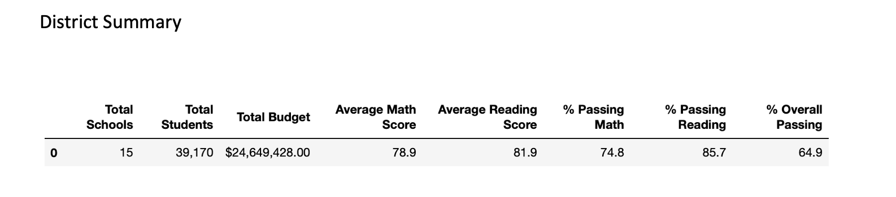
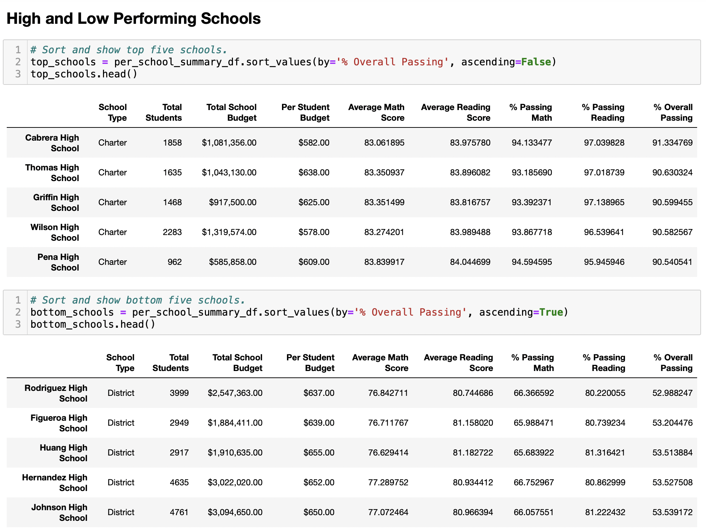
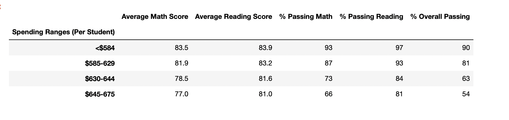
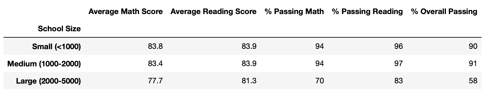
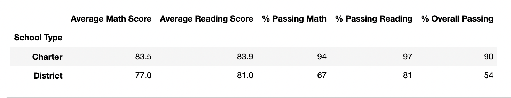

# PyCity School District Analysis

## Project Overview

  I have been tasked with creating an analysis for PyCity School District.  My point contact person is Maria.  Together, we will create a high-level snapshot of the district's key metrics, presented in a table format.  The table will include the top and bottom 5 performing schools, based on the overall passing rate, the average math and reading score per student per grade per school and school performance based on budget per student, school size, and type of school.  
  Furthermore, evidence of academic dishonesty has been brought to the attention of the school board.  This erroneous data will be taken into consideration and adjusted for in our analysis.  This will be accomplished by replacing the erroneous data with "NaN" (not a number), a mathematical term used to describe an undefined value.  The effects of this change will be discussed in the results section of this report.  

## Resources
  - Data Source: schools_complete.csv & students_complete.csv
  - Software: Conda 4.10.1; Python 3.8.5; Jupyter Notebook 6.1.4 with Pandas and NumPy

# Analysis

## Results
  Overall, the omission of the ninth grade scores at Thomas High School has little impact at the district or even the school level.  Because grades are averaged to the tenth of a percent, the impact on percentage points is minimal.  Furthermore, replacing the ninth grade math and reading scores reduces their overall passing average by three hundredths of a percentage point.  This is not enough to drop them from holding the second highest ranking in the district.  Replacing the ninth grade scores does not affect scores by school spending, school size, or school type.  These are all matrices that aggregate totals from the percentages from the whole school district.  In other words, we are looking at data from a very high level.  
  
1. As described below, the district summary shows an overall passing of 64.9% and a total budget of 25 million dollars for 15 schools:
  
  
  
2. This chart shows the top and bottom 5 schools in the district.

  
  
3. The following chart shows that school that spend less than $584 have a the highest overall passing percent.
  
  
  
4. This chart shows that the overall passing by school size is highest when the population is between 1000-2000 students.

  

5. Additionally, charter schools have a higher overall passing percent, as shown below.
  
  

## Summary
The following bullets address the School District's Matrices and highlights the conclusions from our analysis:

- There was little change in the math and reading scores, percentages, and overall performances for the district analysis after the ninth grade scores from Thomas High School were replaced with NaNs.  The larger picture shows that charter schools are outperforming district schools.  However, neither the geographical location nor socioeconomics were taken into account; and therefore, any conclusions drawn from this chart may be showing a correlation not a direct cause between the two types of schools.  
- The data does clearly show that schools that have a population of less than 2000 students and spend around $600 per student have the highest success rate.  
- Lastly, even though the average of each schools math score and the average of each schools reading scores are passing, as shown in the top and bottom Preforming Schools Chart, we are still failing to educate 40% of the students in math skills and 20% of the students in reading skills.  In other words, 40% of students in each school did not pass the the math and 20% of students in each school did not pass the reading. 

